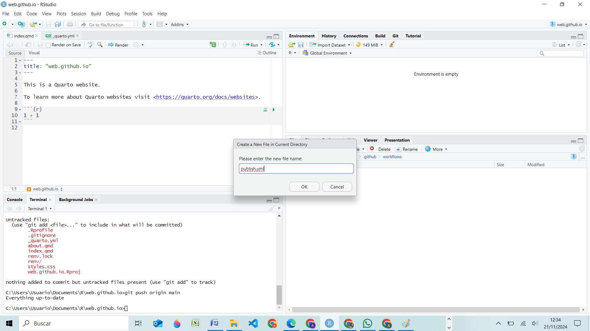

"\# jademoreta.github.io" \#

Indicaciones para crear sitios web y publicarlos en Github-pages

\- Primero hay que crear la cuenta de git.

\- Después hay que crear la cuenta en github.

\- Abrimos R studio

\- Creamos un proyecto con las siguientes características:

\- Use rev with this project

\- Create a git repository

\- El proyecto debe llevar: nombre.github.io

-   Creamos un repositorio en github con las siguientes características

-   El repositorio debe llevar: nombre.github.io.

    

En la terminal de R pegamos los códigos que se muestran en github:

Seguido de esto debemos digitar los siguientes códigos para que, desde R
se copien en github:

git status

git add .

git commit -m "Initial commit" \*\*entre comillas están los comentarios
de cada cambio"

git push origin main

Refrescamos la página de github y entramos en settings/main/wiew all
branches/New branch/ y creamos la gh-pages como se ve en la siguiente
figura:

En R dentro del proyecto vamos a crear dos carpetas y un file. Primero
la carpeta .github, dentro de esta la carpeta workflows y dentro de esta
el file publish.yml

 Buscamos el código de la página de quarto
oficial en el apartado de los archivos rev

Lo pegamos en el archivo de R recién creado y guardamos los cambios

Subimos la información a git y a github mediante los siguientes códigos:

git status

git add .

git commit -m "Add publish.yml to automate publishing of site" "están
los comentarios de cada cambio"

git push origin main

Ahora nos vamos a github y seleccionamos Settings/main/Gh-pages/
finalmente Save

Se cargan los cambios en github y se acaba de desplegar la web

Cuando realicemos cambios en los archivos de R debemos ejecutar en la
terminal los códigos para subir la información a git y github

git status

git add .

git commit -m "poner los comentarios de cada cambio"

git push origin main

